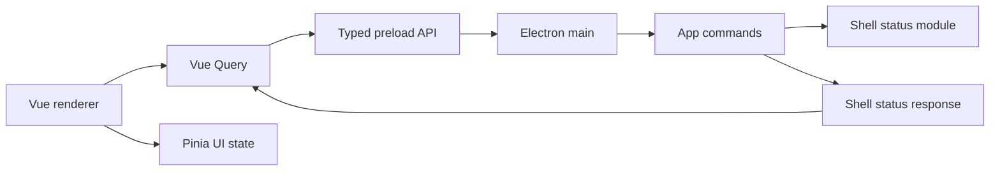

# Technical Design: App Shell Bootstrap

Status: lessons + redo design

Purpose: help next agent bootstrap app shell with fewer choices, fewer traps, better DX. Prototype taught useful things. This doc keeps wins, turns mistakes into guardrails.

## Positive Retrospective

### Keep These Wins

#### Responsibility split worked

Renderer did not own durable truth. Keep this.

Target shape still right:

- Electron main owns local store.
- Preload exposes typed API.
- Vue Query reads async API.
- Pinia owns UI-only state.
- Domain modules avoid Vue/Electron imports.

This split is foundation.

#### Vue Query + Pinia shape worked

Vue Query = persisted server-state cache, even though backend is local IPC.

Pinia = drafts, nav, dialogs, form progress.

Rule:

- Future persistence owns durable truth.
- Main process transactions.
- IPC commands.
- Vue Query invalidation after commit.
- Pinia never mirrors tables.

#### Tests gave fast feedback

Smoke test found preload output path mismatch.

Vitest found native SQLite ABI pain.

Keep tests early. They protect bootstrap.

#### Runnable prototype useful

Prototype made unknowns visible. Useful.

### Guardrails From Prototype

#### Start smaller than Rollover

Rollover is real work, but poor bootstrap slice. It depends on:

- Product Master.
- Customer Master.
- Opening Stock.
- transaction ledger.
- Inventory projection.
- End of Day Report formulas.
- Void + Successor.
- per-day counters.
- reports folder behavior.
- crash recovery.

Without those, Rollover skeleton forces fake seams. Delay.

Better sequence:

1. App shell bootstrap.
2. Product Master.
3. Customer Master.
4. Opening Stock bootstrap.
5. transaction ledger.
6. Inventory projection.
7. Rollover.

#### Keep PRD tight

PRD had many true requirements, but not all belonged in first slice.

Move-to-later examples:

- Future transaction modules named before any table exists.
- End of Day Report shape before Product/Sale/Purchase exist.
- Rollover re-export after missed transactions before missed transactions can exist.
- numbering contracts before first entity is implemented.

Better PRD rule for app shell:

- One startup path.
- One navigation shell.
- One smoke test.
- Max 8 acceptance criteria.
- Out-of-scope bigger than in-scope.

Use grilling before code. Goal: cut scope to executable core.

#### Install design system before UI

v1 proved shadcn-vue + reka-ui works. Bootstrap should use it first.

Next time:

1. Configure shadcn-vue.
2. Add needed components.
3. Build UI only using those primitives.
4. Customize later.

No bespoke buttons/cards/forms in app shell unless shadcn-vue lacks primitive.

#### Decide DB after shell, before persistence

Started with `better-sqlite3`, hit Electron native rebuild/toolchain pain, pivoted to `node:sqlite`.

`node:sqlite` works in prototype. It should not sneak into foundation by accident. Transactional integrity and crash recovery need deliberate DB choice.

Better:

- Pick mature SQLite adapter up front.
- Accept/document native build toolchain if needed.
- Prove Electron packaging + Vitest both use it before domain work.
- Record fallback.

#### Treat DevEx as product feature

V2 goal says fast loop, clear setup.

We discovered issues reactively:

- pnpm build approvals.
- Vite peer mismatch.
- shadcn-vue framework detection.
- Electron Linux sandbox.
- native SQLite rebuild split.
- archived v1 package leaking workspace warnings.

These should be designed before domain code.

#### Keep work atomic

Prototype mixed too much:

- ADR + scaffold + deps + DB + UI + tests + design-system config all interleaved.

Better sequence:

1. ADR only.
2. package/tooling only.
3. design system only.
4. app shell static route only.
5. IPC health check only.
6. Vue Query event bridge only.
7. smoke test only.

Each step green before next.

## Redo Strategy

Redo "App Shell Bootstrap" alone.

App shell should prove:

- scaffold works.
- design system works.
- routing works.
- typed preload API works.
- Vue Query can call IPC.
- Pinia can hold UI state.
- Playwright can launch Electron.
- `pnpm verify` is boring.

No Product Master decisions in app-shell TTD. Next agent only needs route label and placeholder. Product Master gets own PRD/TTD next.

## Technical Design

### Goals

- Runnable Electron app.
- shadcn-vue configured from start.
- Typed IPC boundary.
- Vue Query cache invalidation proven.
- Pinia UI state proven.
- First smoke test green.
- DX documented.

### Non-Goals

- No Product Master schema.
- No Product Master CRUD.
- No Customer Master schema.
- No Rollover.
- No End of Day Report.
- No Inventory projection.
- No Sale/Purchase.
- No Opening Stock.
- No DB adapter decision unless app shell needs persistence.
- No printing.
- No Telugu slip rendering.
- No polished dashboard.

## Stack

### Bootstrap Command

Use generator first. Less hand-rolled config.

Command:

```bash
pnpm create @quick-start/electron app-shell-bootstrap --template vue-ts
```

Then copy generated files into repo root, or run in temp dir and port cleanly.

Do not hand-create Electron scaffold unless generator fails.

Why:

- electron-vite config correct by default.
- preload output path correct by default.
- tsconfig shape known.
- package scripts known.
- less chance to invent broken config.

Rules:

- Keep generated structure unless strong reason.
- Compare generated `electron.vite.config.ts` before editing.
- Add changes in small patches after scaffold builds.

### Runtime

Use:

- Electron.
- electron-vite.
- Vue 3.
- TypeScript.
- pnpm.
- Tailwind v4.
- shadcn-vue.
- reka-ui.
- TanStack Vue Query.
- Pinia.
- Vitest.
- Playwright Electron.

### Node Version

Use Node 24 LTS for dev baseline.

Reason:

- current LTS.
- modern TS/tooling support.
- no need for non-LTS.

Do not rely on Node version for DB stability. Electron bundles its own Node.

Add:

```text
.nvmrc -> 24
```

Add package engines:

```json
{
  "engines": {
    "node": ">=24 <25",
    "pnpm": ">=10 <11"
  }
}
```

### SQLite

Do not choose SQLite adapter in app-shell slice unless persistence required.

App shell can use in-memory main-process health/status API.

First DB decision belongs to Product Master or Customer Master slice.

When persistence slice starts, use mature SQLite adapter, not `node:sqlite`, unless ADR accepts risk.

Preferred:

- `better-sqlite3`

Reason:

- mature.
- synchronous transaction API.
- widely used.
- predictable SQLite semantics.

Cost:

- native module.
- Electron rebuild needed.
- Linux needs build tools if prebuild missing.

This cost is acceptable only if DevEx docs/scripts make it boring.

Required scripts:

```json
{
  "scripts": {
    "native:node": "pnpm rebuild better-sqlite3",
    "native:electron": "electron-builder install-app-deps",
    "verify": "pnpm typecheck && pnpm test && pnpm test:smoke"
  }
}
```

Required Linux docs:

```bash
sudo apt install build-essential python3 make g++
pnpm approve-builds
```

Persistence-slice decision gate:

- If native rebuild remains flaky on target Windows laptop, stop.
- Do not continue domain work.
- Choose alternative adapter deliberately.

### Design System

Configure before app UI.

Do not symlink `vite.config.ts` to `electron.vite.config.ts`.

Reason:

- shadcn-vue expects normal Vite config.
- electron-vite config has different shape.
- symlink lies to tools.

Add dedicated tooling config:

```ts
// vite.config.ts
import { resolve } from "node:path";
import { defineConfig } from "vite";
import vue from "@vitejs/plugin-vue";
import tailwindcss from "@tailwindcss/vite";

export default defineConfig({
  root: "src/renderer",
  plugins: [vue(), tailwindcss()],
  resolve: {
    alias: {
      "@renderer": resolve("src/renderer/src"),
      "@shared": resolve("src/shared"),
      "@domain": resolve("src/domain"),
    },
  },
});
```

Add `components.json`:

```json
{
  "$schema": "https://shadcn-vue.com/schema.json",
  "style": "new-york",
  "typescript": true,
  "tailwind": {
    "config": "",
    "css": "src/renderer/src/styles.css",
    "baseColor": "neutral",
    "cssVariables": true,
    "prefix": ""
  },
  "aliases": {
    "components": "@renderer/components",
    "composables": "@renderer/composables",
    "utils": "@renderer/lib/utils",
    "ui": "@renderer/components/ui",
    "lib": "@renderer/lib"
  },
  "iconLibrary": "lucide"
}
```

Add components before writing app UI:

```bash
pnpm dlx shadcn-vue@latest add button card dialog input label table
```

Use shadcn components in shell screens.

## Architecture

### Runtime Flow



### Rules

- Renderer never imports DB.
- Renderer never mutates durable state directly.
- Main process owns host behavior.
- Shell status module owns startup/readiness info.
- Vue Query owns backend-read cache.
- Pinia owns local draft state.
- shadcn-vue owns base UI primitives.

## App Shell Slice

### What Next Agent Needs

Needs app-shell facts only:

- app opens locally.
- route shell exists.
- nav has placeholders for future workflows.
- unavailable routes clearly say "not built yet".
- typed preload API exists.
- Vue Query can call a main-process async fn.
- Pinia can hold UI-only nav/dialog state.
- shadcn-vue components render.
- smoke test launches Electron.

Does not need Product decisions:

- no Product schema.
- no Product validation.
- no Product DB table.
- no Product Master UI.
- no Inventory behavior.

Product decisions belong in Product Master TTD.

### Shell Status API

Use tiny typed API:

```ts
type ShellStatus = {
  appName: "Vajra";
  ready: true;
  version: string;
};

type ShellApi = {
  getStatus: () => Promise<ShellStatus>;
};
```

Purpose:

- proves preload.
- proves IPC.
- proves Vue Query.
- avoids fake domain persistence.

### Vue Query Keys

```ts
["shell", "status"];
```

No domain-change events needed yet. Add event bridge in Product Master slice when first write exists.

## TDD Plan

No horizontal test dump.

One test -> one impl -> green.

### Tracer 1: App Starts

Behavior:

- App opens.
- Shell renders nav.
- Future workflow placeholders visible.

Test:

- Playwright smoke.

Impl:

- Electron shell.
- Router.
- Static shadcn layout.

### Tracer 2: Shell Status Via IPC

Behavior:

- Renderer shows app name/version/readiness from main process.
- Data loaded through Vue Query.
- No direct Electron access from Vue component.

Test:

- Vitest or Playwright smoke through public UI.

Impl:

- `ShellStatus`.
- preload IPC.
- main handler.
- Vue Query `useShellStatusQuery`.

### Tracer 3: Placeholder Navigation

Behavior:

- User sees routes for Product Master, Customer Master, Sales, Purchases, Inventory, Rollover.
- Routes not built yet clearly disabled/placeholder.

Test:

- Playwright smoke.

Impl:

- shadcn nav/card primitives.
- router routes.
- placeholder screen.

### Tracer 4: Pinia UI State

Behavior:

- Selected nav/dialog state lives in Pinia.
- No durable data in Pinia.

Test:

- small store test if useful.
- otherwise covered by UI smoke.

Impl:

- `ui-shell` store.

### Tracer 5: Dev Verify Command

Behavior:

- `pnpm verify` runs typecheck, unit tests, smoke test.

Test:

- CI/local command.

Impl:

- package script.
- README command.

## Atomic Work Plan

Each step green. No mixing.

### Commit 1: Generated Electron Scaffold

Files:

- generated by `pnpm create @quick-start/electron ... --template vue-ts`
- `package.json`
- `electron.vite.config.ts`
- `tsconfig*.json`
- `src/main/*`
- `src/preload/*`
- `src/renderer/*`

Verify:

```bash
pnpm install
pnpm build
```

### Commit 2: Dev Baseline

Files:

- `.nvmrc`
- `README.md`
- `pnpm-workspace.yaml`
- package `engines`
- package `verify` script

Verify:

```bash
pnpm install
pnpm typecheck
```

### Commit 3: shadcn-vue Setup

Files:

- `vite.config.ts`
- `components.json`
- `src/renderer/src/styles.css`
- `src/renderer/src/lib/utils.ts`
- `src/renderer/src/components/ui/*`

Verify:

```bash
pnpm dlx shadcn-vue@latest add button card table dialog input label
pnpm typecheck
```

### Commit 4: Shell Layout + Routes

Files:

- `src/renderer/src/App.vue`
- `src/renderer/src/router.ts`
- `src/renderer/src/views/*`

Verify:

```bash
pnpm typecheck
pnpm test:smoke
```

### Commit 5: Typed Preload + Shell Status

Files:

- `src/shared/api.ts`
- `src/main/ipc.ts`
- `src/main/shell-status.ts`
- `src/renderer/src/queries/shell-status.ts`

Verify:

```bash
pnpm typecheck
pnpm test
```

### Commit 6: Pinia UI State

Files:

- `src/renderer/src/stores/ui-shell.ts`

Verify:

```bash
pnpm typecheck
pnpm test:smoke
```

### Commit 7: DX Docs

Files:

- `README.md`
- `.scratch/.../TTD.md`

Must include:

- install deps.
- approve builds.
- Linux sandbox note.
- shadcn-vue add command.
- verification command.

## DevEx Requirements

Root command:

```bash
pnpm verify
```

Must run:

- typecheck.
- unit/integration tests.
- smoke test.

No hidden setup.

README must state:

- Node version.
- pnpm version.
- Linux packages.
- `pnpm approve-builds`.
- Electron sandbox workaround.
- how to add shadcn-vue component.
- generator command.

## Acceptance Criteria

This redo succeeds only if:

- scaffold comes from `pnpm create @quick-start/electron ... --template vue-ts` unless documented blocker.
- shadcn-vue components exist before app UI.
- app shell route works.
- shell status loads through typed preload IPC + Vue Query.
- future workflow routes show placeholders.
- Pinia used only for UI state.
- `pnpm verify` green.
- no DB adapter introduced in app-shell slice unless separate ADR explains why.
- changes land in small atomic chunks.

## Deferred From First Slice

### Rollover

Important, but dependency-heavy. Delay.

### End of Day Report

Needs real transaction content. Delay.

### Inventory Projection

Needs Product Master + Opening Stock + transaction ledger. Delay.

### `node:sqlite`

Prototype OK. App shell should not need DB. Persistence slice decides.

## Open Decisions Before Redo

Need answer before code:

1. Use generated scaffold in temp dir then copy, or generate directly into repo?
2. Node 24 LTS baseline OK?
3. shadcn component list for shell: `button card table dialog input label` enough?
4. Placeholder route list: Product Master, Customer Master, Sales, Purchases, Inventory, Rollover?

Do not code until these are answered.
